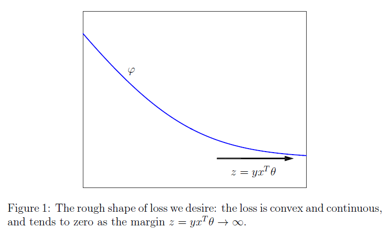
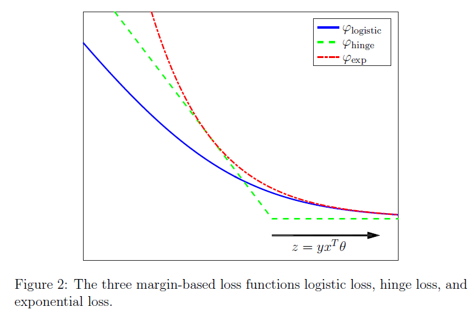
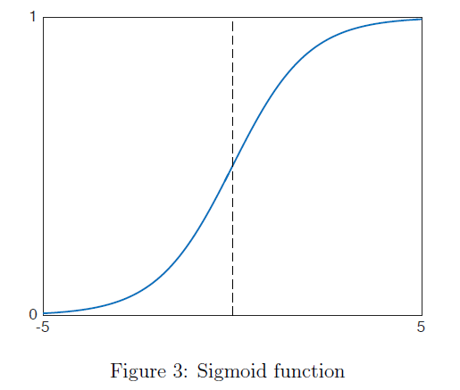

# CS229 课程讲义中文翻译
CS229 Supplementary notes

|原作者|翻译|
|---|---|
|John Duchi|[XiaoDong_Wang](https://github.com/Dongzhixiao) |

|相关链接|
|---|
|[Github 地址](https://github。com/Kivy-CN/Stanford-CS-229-CN)|
|[知乎专栏](https://zhuanlan。zhihu。com/MachineLearn)|
|[斯坦福大学 CS229 课程网站](http://cs229。stanford。edu/)|
|[网易公开课中文字幕视频](http://open。163。com/movie/2008/1/M/C/M6SGF6VB4_M6SGHFBMC。html)|

### 损失函数

#### 1. 二分类

在**二分类问题**中，目标$y$只能取两个值。在本节笔记中，我们将展示如何建模这个问题，通过令$y \in\{-1,+1\}$，这里如果这个例子是正类的一个元素，我们说$y$是$1$，如果这个例子是负类的一个元素，我们说$y = - 1$。和往常一样，我们假设我们的输入特征$x \in \mathbb{R}^{n}$。

和我们处理监督学习问题的标准方法一样，我们首先为我们的假设类选择一个表示（我们试图学习的内容），然后选择一个损失函数，我们将使其最小化。在二分类问题中，通常使用假设类的形式为$h_{\theta}(x)=\theta^{T} x$比较方便，当出现一个新例子$x$，我们把它归类为正例或负例取决于$\theta^{T} x$的符号，也就是说，我们预测如下的式子：

$$
\operatorname{sign}\left(h_{\theta}(x)\right)=\operatorname{sign}\left(\theta^{T} x\right) \text { where } \operatorname{sign}(t)=\left\{\begin{array}{ll}{1} & {\text { if } t>0} \\ {0} & {\text { if } t=0} \\ {-1} & {\text { if } t<0}\end{array}\right.
$$

那么在一个二元分类问题中，参数为$\theta$的假设函数$h_\theta$分类一个特定的例子$(x,y)$是否正确可以通过下式来判断：

$$
\operatorname{sign}\left(\theta^{T} x\right)=y \quad \text { or equivalently } \quad y \theta^{T} x>0 \qquad\qquad(1)
$$

式$(1)$中$y \theta^{T} x$的值在二分类问题中是一个非常重要的量。重要到我们称下式的值

$$
y \theta^{T} x
$$

为例子$(x,y)$的边界(margin)。尽管不总是这样，但是人们通常会将$h_{\theta}(x)=x^{T} \theta$的值解释为对参数向量$\theta$为点$x$分配标签的置信度的度量。标签的判别标准是：如果$x^{T} \theta$非常负（或非常正），则我们更坚信标签$y$是负例（正例）。

既然选择了数据的表示形式，就必须选择损失函数。直观上，我们想要选择一些这样的损失函数，即对于我们的训练数据$\left\{\left(x^{(i)}, y^{(i)}\right)\right\}_{i=1}^{m}$来说，参数$\theta$的选择让边界$y^{(i)} \theta^{T} x^{(i)}$对于每一个训练样本都非常大。让我们修正一个假设的例子$(x,y)$，令$z=y x^{T} \theta$代表边界，并且设$\varphi : \mathbb{R} \rightarrow \mathbb{R}$为损失函数——也就是说，例子$(x, y)$的损失在边界$z=y x^{T} \theta$上是$\varphi(z)=\varphi\left(y x^{T} \theta\right)$。对于任何特定的损失函数，我们最小化的经验风险是：

$$
J(\theta)=\frac{1}{m} \sum_{i=1}^{m} \varphi\left(y^{(i)} \theta^{T} x^{(i)}\right)\qquad\qquad(2)
$$

考虑我们想要的行为：我们希望$y^{(i)} \theta^{T} x^{(i)}$对于每个训练样本$i=1, \ldots, m$都是正的，我们应该惩罚那些$\theta$，它们使得训练数据中经常出现$y^{(i)} \theta^{T} x^{(i)}<0$。因此,一个直观的选择是，如果$z > 0$（边界是正的）我们的损失$\varphi(z)$小，而如果$z < 0$（边界是负的）则$\varphi(z)$大。也许最自然的这种损失是$0-1$损失，由下式得出：

$$
\varphi_{\mathrm{zo}}(z)=\left\{\begin{array}{ll}{1} & {\text { if } z \leq 0} \\ {0} & {\text { if } z>0}\end{array}\right.
$$

在这种情况下，损失$J(\theta)$是简单的参数$\theta$在训练集上使得结果错误（误分类）的平均数量。不幸的是，损失函数$\phi_{zo}$是不连续、非凸的（为什么会出现这种情况的解释有点超出本课程的范围了），甚至更令人烦恼的是，使其最小化是一个$NP$难问题。因此，我们更愿意选择具有图$1$中所示形状的损失。也就是说，我们基本上总是使用满足下面条件的损失:

$$
\varphi(z) \rightarrow 0 \text { as } z \rightarrow \infty, \quad \text { while } \varphi(z) \rightarrow \infty \text { as } z \rightarrow-\infty
$$

下面来一些不同的例子，这里有三个损失函数，我们将会在这门课或现在或以后上看到，这些损失函数都是在机器学习中很常用的。

(i) logistic损失函数：

$$
\varphi_{\text { logistic }}(z)=\log \left(1+e^{-z}\right)
$$

(ii) 铰链损失函数(hinge loss)：

$$
\varphi_{\text { hinge }}(z)=[1-z]_{+}=\max \{1-z, 0\}
$$

(iii) 指数损失函数：

$$
\varphi_{\exp }(z)=e^{-z}
$$

在图$2$中，我们画出了这些损失相对于边界$z=y x^{T} \theta$的图像，注意随着边界增长，每个损失函数都趋于零，并且每个损失函数往往随着边界负向增长而趋近$+\infin$。不同的损失函数将产生不同的机器学习过程；特别要指出，logistic损失$\varphi_{\text { logistic }}$对应于逻辑回归问题，铰链损失$\varphi_{\text { hinge }}$产生所谓的支持向量机，以及指数损失产生的经典的提升版本，这两个我们以后将更深入地探讨。

#### 2. 逻辑回归

有了这一背景知识，我们现在对Andrew Ng课堂笔记中的逻辑回归给出了一个补充的观点。当我们使用二分标签$y \in\{-1,1\}$时，可以更简洁地编写逻辑回归算法。特别地，我们使用Logistic损失：

$$
\varphi_{\text { logistic }}\left(y x^{T} \theta\right)=\log \left(1+\exp \left(-y x^{T} \theta\right)\right)
$$

和逻辑回归算法对应于选择$\theta$来最小化下面的式子：

$$
J(\theta)=\frac{1}{m} \sum_{i=1}^{m} \varphi_{\text {logistic}}\left(y^{(i)} \theta^{T} x^{(i)}\right)=\frac{1}{m} \sum_{i=1}^{m} \log \left(1+\exp \left(-y^{(i)} \theta^{T} x^{(i)}\right)\right)
$$

粗略地，我们希望选择$\theta$最小化平均logistic损失，即产生的一个$\theta$对于大多数（甚至全部）训练样本，都可以使得$y^{(i)} \theta^{T} x^{(i)}>0$。

##### 2.1 概率解释

与线性回归（最小二乘）类似，逻辑回归也可以用概率解释。为此，我们定义sigmoid函数（也常称为逻辑函数）：

$$
g(z)=\frac{1}{1+e^{-z}}
$$

如图$3$所示。特别的，sigmoid函数满足：

$$
g(z)+g(-z)=\frac{1}{1+e^{-z}}+\frac{1}{1+e^{z}}=\frac{e^{z}}{1+e^{z}}+\frac{1}{1+e^{z}}=1
$$

因此我们可以用它来定义一个概率模型进行二分类。特别的，对于$y \in\{-1,1\}$，我们将分类的逻辑模型定义为：

$$
p(Y=y | x ; \theta)=g\left(y x^{T} \theta\right)=\frac{1}{1+e^{-y x^{T} \theta}}
$$

对于积分，我们看到如果边界$y x^{T} \theta$很大——比如超过$5$等——则$p(Y=y | x ; \theta)=g\left(y x^{T} \theta\right) \approx 1$，也就是说，我们给标签为$y$的事件分配了接近$1$的概率。相反地，如果$y x^{T} \theta$很小，则$p(Y=y | x ; \theta) \approx 0$。

通过将假设类重新定义为：

$$
h_{\theta}(x)=g\left(\theta^{T} x\right)=\frac{1}{1+e^{-\theta^{T} x}}
$$

然后我们得到训练数据的似然函数是：

$$
L(\theta)=\prod_{i=1}^{m} p\left(Y=y^{(i)} | x^{(i)} ; \theta\right)=\prod_{i=1}^{m} h_{\theta}\left(y^{(i)} x^{(i)}\right)
$$

对数似然函数的精确解是：

$$
\ell(\theta)=\sum_{i=1}^{m} \log h_{\theta}\left(y^{(i)} x^{(i)}\right)=-\sum_{i=1}^{m} \log \left(1+e^{-y^{(i)} \theta^{T} x^{(i)}}\right)=-m J(\theta)
$$

其中$J(\theta)$是来自等式$(3)$的准确的逻辑回归损失。也就是说，逻辑模型中的最大似然$(4)$是和平均逻辑损失同样最小化了，我们又一次得到了逻辑回归。

##### 2.2 梯度下降法

逻辑回归的最后一部分是拟合实际模型。通常情况下，我们考虑基于梯度下降的过程来执行这种最小化。考虑到这一点，我们现在展示如何对逻辑损失求导。对于函数$\varphi_{\text { logistic }}(z)=\log \left(1+e^{-z}\right)$我们有一维导数：

$$
\frac{d}{d z} \varphi_{\text { logistic }}(z)=\varphi_{\text { logistic }}^{\prime}(z)=\frac{1}{1+e^{-z}} \cdot \frac{d}{d z} e^{-z}=-\frac{e^{-z}}{1+e^{-z}}=-\frac{1}{1+e^{z}}=-g(-z)
$$

其中$g$是sigmoid函数。然后我们应用链式法则来找出单独的训练样本$(x, y)$的结果，我们有

$$
\frac{\partial}{\partial \theta_{k}} \varphi_{\text {logistic}}\left(y x^{T} \theta\right)=-g\left(-y x^{T} \theta\right) \frac{\partial}{\partial \theta_{k}}\left(y x^{T} \theta\right)=-g\left(-y x^{T} \theta\right) y x_{k}
$$

因此，随机梯度下降最小化$J(\theta)$算法对于$t=1,2, \ldots$，$\alpha_t$为在时间$t$时刻的步长，执行以下迭代：

1. 随机均匀的从$i \in\{1, \ldots, m\}$中选择一个样本
2. 执行梯度更新：

$$
\begin{aligned} 
\theta^{(t+1)} &=\theta^{(t)}-\alpha_{t} \cdot \nabla_{\theta} \varphi_{\text { logistic }}\left(y^{(i)} x^{(i)^{T}} \theta^{(t)}\right) \\ 
&=\theta^{(t)}+\alpha_{t} g\left(-y^{(i)} x^{(i)^{T}} \theta^{(t)}\right) y^{(i)} x^{(i)}=\theta^{(t)}+\alpha_{t} h_{\theta^{(t)}}\left(-y^{(i)} x^{(i)}\right) y^{(i)} x^{(i)} 
\end{aligned}
$$

这个更新是很直观的：如果当前的假设$h_{\theta^{(t)}}$为不正确的标签$-y^{(i)}$分配接近$1$的概率，则我们通过将$\theta$朝着$y^{(i)} x^{(i)}$方向移动来尽量减少损失。相反，如果当前的假设$h_{\theta^{(t)}}$为不正确的标签$-y^{(i)}$分配接近$0$的概率，则更新实际上什么也不做。