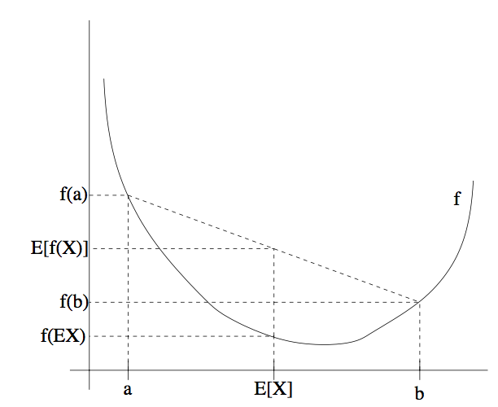

# CS229 课程讲义中文翻译

| 原作者 | 翻译 | 校对 |
| --- | --- | --- |
| [Andrew Ng  吴恩达](http://www.andrewng.org/) | [CycleUser](https://www.zhihu.com/people/cycleuser/columns) | [XiaoDong_Wang](https://github.com/Dongzhixiao) |

|相关链接|
|---|
|[Github 地址](https://github.com/Kivy-CN/Stanford-CS-229-CN)|
|[知乎专栏](https://zhuanlan.zhihu.com/MachineLearn)|
|[斯坦福大学 CS229 课程网站](http://cs229.stanford.edu/)|
|[网易公开课中文字幕视频](http://open.163.com/movie/2008/1/M/C/M6SGF6VB4_M6SGHFBMC.html)|

# 第八章

### 第九部分 期望最大化算法(EM algorithm)

在前面的若干讲义中，我们已经讲过了期望最大化算法（EM algorithm），使用场景是对一个高斯混合模型进行拟合（fitting a mixture of Gaussians）。在本章里面，我们要给出期望最大化算法（EM algorithm）的更广泛应用，并且演示如何应用于一个大系列的具有潜在变量（latent variables）的估计问题（estimation problems）。我们的讨论从 **Jensen 不等式（Jensen’s inequality）** 开始，这是一个非常有用的结论。

#### 1 Jensen 不等式（Jensen’s inequality）
设 $f$ 为一个函数，其定义域（domain）为整个实数域（set of real numbers）。这里要回忆一下，如果函数 $f$ 的二阶导数 $f''(x) \ge 0$ （其中的 $x \in R$），则函数 $f$ 为一个凸函数（convex function）。如果输入的为向量变量，那么这个函数就泛化了，这时候该函数的海森矩阵（hessian） $H$ 就是一个半正定矩阵（positive semi-definite $H \ge 0$）。如果对于所有的 $x$ ，都有二阶导数 $f''(x) > 0$，那么我们称这个函数 $f$ 是严格凸函数（对应向量值作为变量的情况，对应的条件就是海森矩阵必须为正定，写作 $H > 0$）。这样就可以用如下方式来表述 Jensen 不等式：

**定理（Theorem）：** 设 $f$ 是一个凸函数，且设 $X$ 是一个随机变量（random variable）。然后则有：

$$
E[f(X)] \ge f(EX).
$$

`译者注：函数的期望大于等于期望的函数值`

此外，如果函数 $f$ 是严格凸函数，那么 $E[f(X)] = f(EX)$ 当且仅当 $X = E[X]$ 的概率（probability）为 $1$ 的时候成立（例如 $X$ 是一个常数）。

还记得我们之前的约定（convention）吧，写期望（expectations）的时候可以偶尔去掉括号（parentheses），所以在上面的定理中， $f(EX) = f(E[X])$。

为了容易理解这个定理，可以参考下面的图：

上图中，$f$ 是一个凸函数，在图中用实线表示。另外 $X$ 是一个随机变量，有 $0.5$ 的概率（chance）取值为 $a$，另外有 $0.5$ 的概率取值为 $b$（在图中 $x$ 轴上标出了）。这样，$X$ 的期望值就在图中所示的 $a$ 和 $b$ 的中点位置。

图中在 $y$ 轴上也标出了 $f(a)$, $f(b)$ 和 $f(E[X])$。接下来函数的期望值 $E[f(X)]$ 在 $y$ 轴上就处于 $f(a)$ 和 $f(b)$ 之间的中点的位置。如图中所示，在这个例子中由于 $f$ 是凸函数，很明显 $E[f(X)] ≥ f(EX)$。

顺便说一下，很多人都记不住不等式的方向，所以就不妨用画图来记住，这是很好的方法，还可以通过图像很快来找到答案。

**备注。** 回想一下，当且仅当 $-f$ 是严格凸函数（[strictly] convex）的时候，$f$ 是严格凹函数（[strictly] concave）（例如，二阶导数 $f''(x)\le 0$ 或者其海森矩阵 $H ≤ 0$）。Jensen 不等式也适用于凹函数（concave）$f$，但不等式的方向要反过来，也就是对于凹函数，$E[f(X)] \le f(EX)$。

#### 2 期望最大化算法（EM algorithm） 
假如我们有一个估计问题（estimation problem），其中由训练样本集 $\{x^{(1)}, ..., x^{(m)}\}$ 包含了 $m$ 个独立样本。我们用模型 $p(x, z)$ 对数据进行建模，拟合其参数（parameters），其中的似然函数（likelihood）如下所示：

$$
\begin{aligned}
l(\theta) &= \sum_{i=1}^m\log p(x;\theta) \\
&= \sum_{i=1}^m\log\sum_z p(x,z;\theta)
\end{aligned}
$$

然而，确切地找到对参数 $\theta$ 的最大似然估计（maximum likelihood estimates）可能会很难。此处的 $z^{(i)}$ 是一个潜在的随机变量（latent random variables）；通常情况下，如果 $z^{(i)}$ 事先得到了，然后再进行最大似然估计，就容易多了。

这种环境下，使用期望最大化算法（EM algorithm）就能很有效地实现最大似然估计（maximum likelihood estimation）。明确地对似然函数$l(\theta)$进行最大化可能是很困难的，所以我们的策略就是使用一种替代，在 $E$ 步骤 构建一个 $l$ 的下限（lower-bound），然后在 $M$ 步骤 对这个下限进行优化。

对于每个 $i$，设 $Q_i$ 是某个对 $z$ 的分布（$\sum_z Q_i(z) = 1, Q_i(z)\ge 0$）。则有下列各式$^1$：

$$
\begin{aligned}
\sum_i\log p(x^{(i)};\theta) &= \sum_i\log\sum_{z^{(i)}}p(x^{(i)},z^{(i)};\theta)&(1) \\
&= \sum_i\log\sum_{z^{(i)}}Q_i(z^{(i)})\frac{p(x^{(i)},z^{(i)};\theta)}{Q_i(z^{(i)})} &(2)\\
&\ge \sum_i\sum_{z^{(i)}}Q_i(z^{(i)})\log\frac{p(x^{(i)},z^{(i)};\theta)}{Q_i(z^{(i)})}&(3) 
\end{aligned}
$$

>1 如果 $z$ 是连续的，那么 $Q_i$ 就是一个密度函数（density），上面讨论中提到的对 $z$ 的求和（summations）就要用对 $z$ 的积分（integral）来替代。

上面推导（derivation）的最后一步使用了 Jensen 不等式（Jensen’s inequality）。其中的 $f(x) = log x$ 是一个凹函数（concave function），因为其二阶导数 $f''(x) = -1/x^2 < 0$ 在整个定义域（domain） $x\in R^+$ 上都成立。

此外，上式的求和中的单项： 

$$
\sum_{z^{(i)}}Q_i(z^{(i)})[\frac{p(x^{(i)},z^{(i)};\theta)}{Q_i(z^{(i)})}]
$$

是变量（quantity）$[p(x^{(i)}, z^{(i)}; \theta)/Q_i(z^{(i)})]$ 基于 $z^{(i)}$ 的期望，其中 $z^{(i)}$ 是根据 $Q_i$ 给定的分布确定。然后利用 Jensen 不等式（Jensen’s inequality），就得到了：

$$
f(E_{z^{(i)}\sim Q_i}[\frac{p(x^{(i)},z^{(i)};\theta)}{Q_i(z^{(i)})}])\ge
E_{z^{(i)}\sim Q_i}[f(\frac{p(x^{(i)},z^{(i)};\theta)}{Q_i(z^{(i)})})]
$$

其中上面的角标 $“z^{(i)}\sim Q_i”$ 就表明这个期望是对于依据分布 $Q_i$ 来确定的 $z^{(i)}$ 的。这样就可以从等式 $(2)$ 推导出等式 $(3)$。

接下来，对于任意的一个分布 $Q_i$，上面的等式 $(3)$ 就给出了似然函数 $l(\theta)$ 的下限（lower-bound）。那么对于 $Q_i$ 有很多种选择。咱们该选哪个呢？如果我们对参数 $\theta$ 有某种当前的估计，很自然就可以设置这个下限为 $\theta$ 这个值。也就是，针对当前的 $\theta$ 值，我们令上面的不等式中的符号为等号。（稍后我们能看到，这样就能证明，随着 $EM$迭代过程的进行，似然函数 $l(\theta)$ 就会单调递增（increases monotonically）。）

为了让上面的限定值（bound）与 $\theta$ 特定值（particular value）联系紧密（tight），我们需要上面推导过程中的 Jensen 不等式这一步中等号成立。要让这个条件成立，我们只需确保是在对一个常数值随机变量（“constant”-valued random variable）求期望。也就是需要：

$$
\frac{p(x^{(i)},z^{(i)};\theta)}{Q_i(z^{(i)})}=c
$$

其中常数 $c$ 不依赖 $z^{(i)}$。要实现这一条件，只需满足：

$$
Q_i(z^{(i)})\propto p(x^{(i)},z^{(i)};\theta)
$$

实际上，由于我们已知 $\sum_z Q_i(z^{(i)}) = 1$（因为这是一个分布），这就进一步表明：

$$
\begin{aligned}
Q_i(z^{(i)}) &= \frac{p(x^{(i)},z^{(i)};\theta)}{\sum_z p(x^{(i)},z;\theta)} \\
&= \frac{p(x^{(i)},z^{(i)};\theta)}{p(x^{(i)};\theta)} \\
&= p(z^{(i)}|x^{(i)};\theta)
\end{aligned}
$$

因此，在给定 $x^{(i)}$ 和参数 $\theta$ 的设置下，我们可以简单地把 $Q_i$ 设置为 $z^{(i)}$ 的后验分布（posterior distribution）。

接下来，对 $Q_i$ 的选择，等式 $(3)$ 就给出了似然函数对数（log likelihood）的一个下限，而似然函数（likelihood）正是我们要试图求最大值（maximize）的。这就是 $E$ 步骤。接下来在算法的 $M$ 步骤中，就最大化等式 $(3)$ 当中的方程，然后得到新的参数 $\theta$。重复这两个步骤，就是完整的 $EM$ 算法，如下所示：

&emsp;重复下列过程直到收敛（convergence）:  {

&emsp;&emsp;（$E$ 步骤）对每个 $i$，设 
　　
$$
Q_i(z^{(i)}):=p(z^{(i)}|x^{(i)};\theta)
$$

&emsp;&emsp;（$M$ 步骤） 设 

$$
\theta := arg\max_\theta\sum_i\sum_{z^{(i)}}Q_i(z^{(i)})log\frac{p(x^{(i)},z^{(i)};\theta)}{Q_i(z^{(i)})}
$$

} 

怎么才能知道这个算法是否会收敛（converge）呢？设 $\theta^{(t)}$ 和 $\theta^{(t+1)}$ 是上面 $EM$ 迭代过程中的某两个参数（parameters）。接下来我们就要证明一下 $l(\theta^{(t)})\le l(\theta^{(t+1)})$，这就表明 $EM$ 迭代过程总是让似然函数对数（log-likelihood）单调递增（monotonically improves）。证明这个结论的关键就在于对 $Q_i$ 的选择中。在上面$EM$迭代中，参数的起点设为 $\theta^{(t)}$，我们就可以选择 $Q_i^{(t)}(z^{(i)}): = p(z^{(i)}|x^{(i)};\theta^{(t)})$。之前我们已经看到了，正如等式 $(3)$ 的推导过程中所示，这样选择能保证 Jensen 不等式的等号成立，因此：

$$
l(\theta^{(t)})=\sum_i\sum_{z^{(i)}}Q_i^{(t)}(z^{(i)})log\frac{p(x^{(i)},z^{(i)};\theta^{(t)})}{Q_i^{(t)}(z^{(i)})}
$$

参数 $\theta^{(t+1)}$  可以通过对上面等式中等号右侧进行最大化而得到。因此： 

$$
\begin{aligned}
l(\theta^{(t+1)}) &\ge \sum_i\sum_{z^{(i)}}Q_i^{(t)}(z^{(i)})log\frac{p(x^{(i)},z^{(i)};\theta^{(t+1)})}{Q_i^{(t)}(z^{(i)})} &(4)\\
&\ge \sum_i\sum_{z^{(i)}}Q_i^{(t)}(z^{(i)})log\frac{p(x^{(i)},z^{(i)};\theta^{(t)})}{Q_i^{(t)}(z^{(i)})} &(5)\\
&= l(\theta^{(t)}) &(6)
\end{aligned}
$$

上面的第一个不等式推自：

$$
l(\theta)\ge \sum_i\sum_{z^{(i)}}Q_i(z^{(i)})log\frac{p(x^{(i)},z^{(i)};\theta)}{Q_i(z^{(i)})}
$$

上面这个不等式对于任意值的 $Q_i$ 和 $\theta$ 都成立，尤其当 $Q_i = Q_i^{(t)}, \theta = \theta^{(t+1)}$。要得到等式 $(5)$，我们要利用 $\theta^{(t+1)}$ 的选择能够保证：

$$
arg\max_\theta \sum_i\sum_{z^{(i)}}Q_i(z^{(i)})log\frac{p(x^{(i)},z^{(i)};\theta)}{Q_i(z^{(i)})}
$$

这个式子对 $\theta^{(t+1)}$ 得到的值必须大于等于 $\theta^{(t)}$ 得到的值。最后，推导等式$(6)$ 的这一步，正如之前所示，因为在选择的时候我们选的 $Q_i^{(t)}$ 就是要保证 Jensen 不等式对 $\theta^{(t)}$ 等号成立。

因此，$EM$ 算法就能够导致似然函数（likelihood）的单调收敛。在我们推导 $EM$ 算法的过程中，我们要一直运行该算法到收敛。得到了上面的结果之后，可以使用一个合理的收敛检测（reasonable convergence test）来检查在成功的迭代（successive iterations）之间的 $l(\theta)$ 的增长是否小于某些容忍参数（tolerance parameter），如果 $EM$ 算法对 $l(\theta)$ 的增大速度很慢，就声明收敛（declare convergence）。

**备注。** 如果我们定义

$$
J(Q, \theta)=\sum_i\sum_{z^{(i)}}Q_i(z^{(i)})log\frac{p(x^{(i)},z^{(i)};\theta)}{Q_i(z^{(i)})}
$$

通过我们之前的推导，就能知道 $l(\theta) ≥ J(Q, \theta)$。这样 $EM$ 算法也可看作是在 $J$ 上的坐标上升（coordinate ascent），其中 $E$ 步骤在 $Q$ 上对 $J$ 进行了最大化（自己检查哈），然后 $M$ 步骤则在 $\theta$ 上对 $J$ 进行最大化。

#### 3 高斯混合模型回顾（Mixture of Gaussians revisited ）

有了对 $EM$ 算法的广义定义（general definition）之后，我们就可以回顾一下之前的高斯混合模型问题，其中要拟合的参数有 $\phi, \mu$ 和$\Sigma$。为了避免啰嗦，这里就只给出在 $M$ 步骤中对$\phi$ 和 $\mu_j$ 进行更新的推导，关于 $\Sigma_j$ 的更新推导就由读者当作练习自己来吧。

$E$ 步骤很简单。还是按照上面的算法推导过程，只需要计算：

$$
w_j^{(i)}=Q_i(z^{(i)}=j)=P(z^{(i)}=j|x^{(i)};\phi,\mu,\Sigma)
$$

这里面的 $“Q_i(z^{(i)} = j)”$ 表示的是在分布 $Q_i$上 $z^{(i)}$ 取值 $j$ 的概率。

接下来在 $M$ 步骤，就要最大化关于参数 $\phi,\mu,\Sigma$的值： 

$$
\begin{aligned}
\sum_{i=1}^m&\sum_{z^{(i)}}Q_i(z^{(i)})log\frac{p(x^{(i)},z^{(i)};\phi,\mu,\Sigma)}{Q_i(z^{(i)})}\\
&= \sum_{i=1}^m\sum_{j=1}^kQ_i(z^{(i)}=j)log\frac{p(x^{(i)}|z^{(i)}=j;\mu,\Sigma)p(z^{(i)}=j;\phi)}{Q_i(z^{(i)}=j)} \\
&= \sum_{i=1}^m\sum_{j=1}^kw_j^{(i)}log\frac{\frac{1}{(2\pi)^{n/2}|\Sigma_j|^{1/2}}exp(-\frac 12(x^{(i)}-\mu_j)^T\Sigma_j^{-1}(x^{(i)}-\mu_j))\cdot\phi_j}{w_j^{(i)}}
\end{aligned}
$$

先关于 $\mu_l$ 来进行最大化。如果去关于 $\mu_l$ 的（偏）导数（derivative），得到：

$$
\begin{aligned}
\nabla_{\mu_l}&\sum_{i=1}^m\sum_{j=1}^kw_j^{(i)}log\frac{\frac{1}{(2\pi)^{n/2}|\Sigma_j|^{1/2}}exp(-\frac 12(x^{(i)}-\mu_j)^T\Sigma_j^{-1}(x^{(i)}-\mu_j))\cdot\phi_j}{w_j^{(i)}} \\
&= -\nabla_{\mu_l}\sum_{i=1}^m\sum_{j=1}^kw_j^{(i)}\frac 12(x^{(i)}-\mu_j)^T\Sigma_j^{-1}(x^{(i)}-\mu_j) \\
&= \frac 12\sum_{i=1}^m w_l^{(i)}\nabla_{\mu_l}2\mu_l^T\Sigma_l^{-1}x^{(i)}-\mu_l^T\Sigma_l^{-1}\mu_l  \\
&= \sum_{i=1}^m w_l^{(i)}(\Sigma_l^{-1}x^{(i)}-\Sigma_l^{-1}\mu_l)
\end{aligned}
$$

设上式为零，然后解出 $\mu_l$ 就产生了更新规则（update rule）：

$$
\mu_l := \frac{\sum_{i=1}^m w_l^{(i)}x^{(i)}}{\sum_{i=1}^m w_l^{(i)}}
$$

这个结果咱们在之前的讲义中已经见到过了。

咱们再举一个例子，推导在 $M$ 步骤中参数 $\phi_j$ 的更新规则。把仅关于参数 $\phi_j$ 的表达式结合起来，就能发现只需要最大化下面的表达式：

$$
\sum_{i=1}^m\sum_{j=1}^kw_j^{(i)}log\phi_j
$$

然而，还有一个附加的约束，即 $\phi_j$ 的和为$1$，因为其表示的是概率 $\phi_j = p(z^{(i)} = j;\phi)$。为了保证这个约束条件成立，即 $\sum^k_{j=1}\phi_j = 1$，我们构建一个拉格朗日函数（Lagrangian）：

$$
\mathcal L(\phi)=\sum_{i=1}^m\sum_{j=1}^kw_j^{(i)}log\phi_j+\beta(\sum^k_{j=1}\phi_j - 1)
$$

其中的 $\beta$ 是 拉格朗日乘数（Lagrange multiplier）$^2$ 。求导，然后得到： 

$$
\frac{\partial}{\partial{\phi_j}}\mathcal L(\phi)=\sum_{i=1}^m\frac{w_j^{(i)}}{\phi_j}+1
$$

>2 这里我们不用在意约束条件 $\phi_j \ge 0$，因为很快就能发现，这里推导得到的解会自然满足这个条件的。

设导数为零，然后解方程，就得到了：

$$
\phi_j=\frac{\sum_{i=1}^m w_j^{(i)}}{-\beta}
$$

也就是说，$\phi_j\propto \sum_{i=1}^m w_j^{(i)} $。结合约束条件（constraint）$\Sigma_j \phi_j = 1$，可以很容易地发现 $-\beta = \sum_{i=1}^m\sum_{j=1}^kw_j^{(i)} = \sum_{i=1}^m 1 =m$. （这里用到了条件 $w_j^{(i)} =Q_i(z^{(i)} = j)$，而且因为所有概率之和等于$1$，即$\sum_j w_j^{(i)}=1$）。这样我们就得到了在 $M$ 步骤中对参数 $\phi_j$ 进行更新的规则了：

$$
\phi_j := \frac 1m \sum_{i=1}^m w_j^{(i)}
$$

接下来对 $M$ 步骤中对 $\Sigma_j$ 的更新规则的推导就很容易了。 
