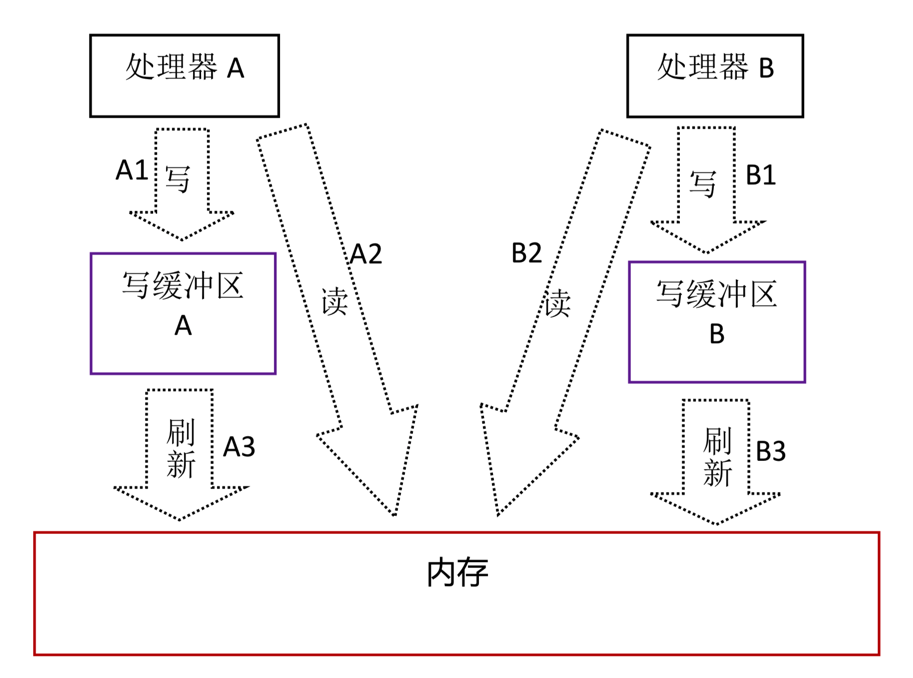
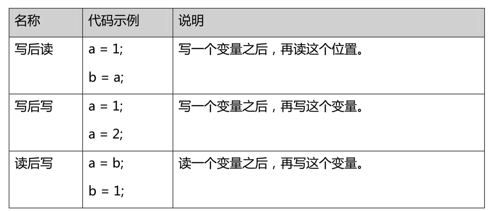
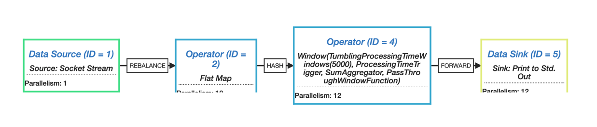

#目的
之前就想做一期关于高并发相关的分享，主要是面向新人的，因为之前修改前人代码，感觉即使是老员工其实也也会有所收获吧
#资料

咱们的话题主要以java为主，也会提一下c或者go做一下对比。下面列了一下参考的资料。


#如何评价代码好坏
先聊一个题外话，什么是评价代码好坏的标准，要衡量这点我把它分为主观的和客观的。
下面的话题以满足需求为前提

##主观
主观方面以理念为主，例如可读性可维护性，可维护性等。
###可读性
可读性会被很多初级开发奉为信条，这里并不是去反对可读性，但是人们对可读性的判断依据比较模糊，也不好衡量

###可维护性
有时候我们被要求对代码添加各种注释，因为有些领导认为有了足够多的注释代码的可读性就会提高，可维护性也会高很多，这样组织对抗人员变动风险的能力就会高很多。
现实很不幸这仍然是一个主观一厢情愿的想法，实际上大多数的程序员在接手别人的代码时，第一个念头往往是重写，因为读代码的成本有时高于维护
这不是说不要大家写注释，毕竟可读性高的代码理解成本低，重写起来也容易。

##客观
客观方面考察方式会比较直观，以模块的可扩展性，解藕为考察重点

###模块化
模块化是衡量代码可维护性的一个有效标尺，它让你的代码具有了复用性，如果有很多雷同代码大块的出现，是应该反思一下了。
模块化很容易教条化，例如早期流行的TDD（测试驱动开发）曾经流行的观点，每个类都可以测试，在AOP技术还不是很发达的时候，这是一个对开发人员一个相当强的模块化约束。据我十多年的开发经验，一个可行性较高的建议是工程中定义的最小物理模块就是你的测试单元，这样既省人力，也是对架构的尊重。

###可扩展性
唯一不变的就是需求的变化，这是在软件界算是一个真理了。这个世界应该没有能适应所有变化的设计，如果非说有那估计就是无设计，毕竟人们对不存在的东西很难挑出毛病。不过程序猿们还是有追求的，不想要在不断的搬砖过程中蹉跎，所以就有了上面的模块化的概念，但是也不是随便模块化，这里面衡量标准就是是不是每次应对需求都要改变底层模块。
总结，代码层次中越底层的变化越慢，越上层的越贴近需求变化。

###性能
上面都是个人观点而且和这次分享没有直接关系，下面进入主题，性能。
这是一个比较大的话题，不过程序猿们为了追求极致的性能可能会把可读性和可维护性抛于脑后，后面会举例说明

##举例
[Turbo Pascal](https://zh.wikipedia.org/zh-hans/Turbo_Pascal)曾被誉为编译速度最快的编译器，作者是[Anders Hejlsberg](https://zh.wikipedia.org/wiki/%E5%AE%89%E5%BE%B7%E6%96%AF%C2%B7%E6%B5%B7%E5%B0%94%E6%96%AF%E4%BC%AF%E6%A0%BC)(C#语言作者，typescript语言作者)，纯汇编打造的编译器性能不用说了，只是当年大神离开Borland去微软之后Delphi产品线也停了，因为没人能继续维护那段代码了。。。

做过图形相关开发的人都会感觉OpenGL的API好难用啊，OpenGLES更难用，h5的canvas不是挺好的嘛，干嘛还设计那么复杂找麻烦吗

MapReduce最早是Google提出的大数据处理的软件架构，这种抽象方式从规则角度规避了并发中的同步问题，在模型抽象期间强制开发者考虑隔离性间，当然副作用也有，就是不直观，对于强调可读性的人来说可能也不算好的设计

#并发

前面之所以讨论了一些代码评价和性能相关问题是因为好的设计和坏的设计对并发的效率也会有比较大的影响，这是比较直观且客观的

##目的
并发的目的有两个：

- 同时提供多个服务
- 因为io操作的速度和cpu不匹配

##解决方案

###进程
这次不多讨论使用进程的并发相关设计，涉及IPC还是一块很大的领域

###线程
线程本质和进程的共同点是可以分到单独的cpu时间片，只是存储不隔离，这点即是灵活的地方，也是它的原罪。

###同步

####基本概念
1. 并发三大特性

    要正确地理解Java多线程问题，要求我们必须深刻的理解“原子性”、“有序性”、“可见性”这三个非常重要和关键的特性

1. 内存模型抽象

 虽然讲的是并发问题，但是避免不了和内存打交道。这里不会介绍太多虚拟机层面的东西，只是将内存简化为两部分共享存储（内存）和局域存储（寄存器，缓存），便于对可见性的理解

 

2. 重新排序 
 - 编译优化 
 - 指令并行重排
 - 内存系统重现排序

 
 
     
    重新排序在多线程情况下会出现难以直观理解的现象
    
    <table style="width:100%">
      <tr>
        <th> Process A </th>
        <th> Process B </th> 
      </tr>
      <tr>
        <td> a = 1 <br> x = b </td>
        <td> b = 1 <br> y = a </td>
      </tr>
      <tr>
        <td colspan='2'>初始状态：a = b = 0 <br> 可能出现结果：x = y = 0</td>
      </tr>
    </table>


    
3. 数据依赖性

 即使有重新排序的可能，但是仍然遵循数据依赖规则

    
    
4. 内存屏障

 除了数据依赖规则还可以通过cpu指令来阻止重新排序

    |屏障类型|指令示例|指令示例|
    |:-:|:-:|:-:|
    |LoadLoad屏障|Load1; LoadLoad; Load2|在Load2及后续读取操作要读取的数据被访问前，保证Load1要读取的数据被读取完毕|
    |StoreStore屏障|Store1; StoreStore; Store2|在Store2及后续写入操作执行前，保证Store1的写入操作对其它处理器可见|
    |LoadStore屏障|Load1; LoadStore; Store2|在Store2及后续写入操作被刷出前，保证Load1要读取的数据被读取完毕|
    |StoreLoad屏障| Store1; StoreLoad; Load2|在Load2及后续所有读取操作执行前，保证Store1的写入对所有处理器可见|
  
3. happen-before
 
 为了化简对内存模型的理解难度，提出了happen before规则
 
 定义:
 
 - 如果一个操作happens-before另一个操作，那么第一个操作的执行结果将对第二个操作可见，而且第一个操作的执行顺序排在第二个操作之前。 
 - 两个操作之间存在happens-before关系，并不意味着一定要按照happens-before原则制定的顺序来执行。如果重排序之后的执行结果与按照happens-before关系来执行的结果一致，那么这种重排序并不非法。

 
 规则:
 
 - 程序次序规则：一个线程内，按照代码顺序，书写在前面的操作先行发生于书写在后面的操作；
 - 锁定规则：一个unLock操作先行发生于后面对同一个锁额lock操作；
 - volatile变量规则：对一个变量的写操作先行发生于后面对这个变量的读操作；
 - 传递规则：如果操作A先行发生于操作B，而操作B又先行发生于操作C，则可以得出操作A先行发生于操作C；
 - 线程启动规则：Thread对象的start()方法先行发生于此线程的每个一个动作；
 - 线程中断规则：对线程interrupt()方法的调用先行发生于被中断线程的代码检测到中断事件的发生；
 - 线程终结规则：线程中所有的操作都先行发生于线程的终止检测，我们可以通过Thread.join()方法结束、Thread.isAlive()的返回值手段检测到线程已经终止执行；
 - 对象终结规则：一个对象的初始化完成先行发生于他的finalize()方法的开始；
     
    ```java
    //thread 1
    a = 1;
    b = a;
     
    //tread 2
    if(b == 1){
        assert(a == 1)
    }
    ```
    ```java
    //thread 1
    a = 1;
    b = 1;
     
    //tread 2
    if(b == 1){
        assert(a == 1)
    }
    ```

####同步原语 
- 静态初始化

这点经常被人忽略，但是类加载线程安全，这点是虚拟机保证的

```java
public class Resource {
    private static Resource resource;

    static {
        resource = new Resource();

    }

    public static Resource getInstance() {
        return resource;
    }
}

```

- ####synchronized

 synchronized编译成字节码后，是通过monitorenter（入锁）和monitorexit（出锁）两个指令实现的，具体过程如下：


- ####volatile

 volatile除了可以阻止编译优化还会自动加入内存屏障
 
 - 写操作
 
 
 
 - 读操作
 
 
- ####lock

 锁可以理解为将synchronized拆成两部分，所以自带内存屏障的语义，lock前加入acquire屏障，unlock后加入release屏障

 Java 8 自带的锁有三种：可重入锁，读写锁和StampedLock。
 可重入锁的默认版本是非公平锁，公平锁和非公平锁的差别是是否按照顺序取得锁
 

- ####atomic
原子操作可以理解为一种轻量锁，但是内表达的语义也有些，包含读写，自增，自减，交换，CAS等。


#####从粒度上比较
volatile, atomic 小于 lock 小于 sychronized

#####从灵活性上比较
lock 大于 sychronized 大于 volatile, atomic

原子操作的粒度虽然很小但是受制于原子操作原语有限所以能表达的语义也有限，sychronized 可以完成的lock也能完成，但是lock能完成的sychronized却未必可以。
性能上synchronized也没有那么万恶，Java 6之后锁一共有4中状态,级别从低到高依次是:无锁状态、偏向锁状态、轻量级锁状态和重量级锁状态，这几个状态会随着竞争情况逐渐升级。

#####内存屏障

这里再次提到内存屏障是因为在Java中没有任何API可以直接调用，只是以上的同步元语的副作用，下面引用一个C++的例子来说明：

```c++
int data = 0;
std::atomic_int cpp_atomic_int(0);

extern "C" void producer() {
    data = 42;
    std::atomic_thread_fence(std::memory_order_release);
    cpp_atomic_int.store(1, std::memory_order_relaxed);
}

extern "C" void consumer() {
    int p2;
    while (!(p2 = cpp_atomic_int.load(std::memory_order_relaxed)));
    std::atomic_thread_fence(std::memory_order_acquire);
    assert(p2 == 1); // 绝无问题
    assert(data == 42); // 绝无问题
}

int main() {
    std::thread t1(producer);
    std::thread t2(consumer);
    t1.join();
    t2.join();
}

```

##### CAS
原子操作中有一个比较广泛的应用就是Compare And Swap，利用这一特性可以构建无锁队列，JDK的ConcurrentHashMap也是基于这个特性实现的。

###优化实例

下面结合猎豹项目来说明一个优化的例子

优化前

```java
    private final ReadWriteLock lock = new ReentrantReadWriteLock();
    private final Lock r = lock.readLock();
    private final Lock w = lock.writeLock();

...

   private void refreshConfig(List<Application> configApps, Map<String, String> configLocations) {
        configApps.forEach(Application::init);
        // 初始化域名到业务的对照关系，供DNS使用
        ArrayListMultimap<String, String> multiMap = ArrayListMultimap.create();
        for (Application app : configApps) {
            if (!app.isIp) {
                multiMap.put(app.domainOrIp, app.id);
            }
        }

        Splitter splitter = Splitter.on(',').omitEmptyStrings().trimResults();
        TreeRangeMap<Long, String> treeRangeMap = TreeRangeMap.create();

        for (Map.Entry<String, String> location : configLocations.entrySet()) {
            String id = location.getKey();
            String ips = location.getValue();
            splitter.split(ips).forEach(it -> {
                try {
                    Range<Long> range = IpV4Ranges.toRange(it).range;
                    treeRangeMap.put(range, id);
                } catch (Exception e) {
                    // 忽略无效的数据
                }
            });
        }

        w.lock();
        try {
            appMapGroupByIp.clear();
            appMapGroupByDomain.clear();
            Set<String> appIds = new HashSet<>(configApps.size());
            for (Application app : configApps) {
                String domainOrIp = app.domainOrIp;
                if (!Strings.isNullOrEmpty(domainOrIp)) {
                    if (app.isIp) {
                        appMapGroupByIp.put(domainOrIp, app);
                    } else {
                        appMapGroupByDomain.put(domainOrIp, app);
                    }
                    appIds.add(app.id);
                } else {
                    log.warn("不合理的业务: domainOrIp没有值，{}", app);
                }
            }
            // 业务改变时，http判断时生成的缓存需要被同步改变
            // 删除已经不存在的业务（变动的业务由HTTP判断过程进行更新）
            List<String> deletedApps = app2IpPort.keySet().stream()
                    .filter(it -> !appIds.contains(it)).collect(Collectors.toList());
            if (!deletedApps.isEmpty()) {
                deletedApps.forEach(app2IpPort::remove);
                repackIpPorts();
            }

            ipRangeLocations.clear();
            ipRangeLocations.putAll(treeRangeMap);
            host2Apps.clear();

            multiMap.asMap().forEach((host, apps) ->
                    host2Apps.put(host, Lists.newArrayList(apps.iterator()))
            );
        } finally {
            w.unlock();
        }
    }
```

优化后

```java
    private volatile Ip2AppTable ip2AppTable;

....

    private void refreshConfig(List<Application> configApps, Map<String, String> configLocations) {

        List<ApplicationUrl> configAppUrls = configApps.stream().flatMap(Application::split).collect(Collectors.toList());

        Ip2AppTable localIp2AppTable = new Ip2AppTable();
        // 初始化域名到业务的对照关系，供DNS使用
        ArrayListMultimap<String, String> multiMap = ArrayListMultimap.create();
        for (ApplicationUrl app : configAppUrls) {
            if (!app.isIp) {
                multiMap.put(app.domainOrIp, app.id);
            }
            localIp2AppTable.levelTree.add(app);
        }


        Splitter splitter = Splitter.on(',').omitEmptyStrings().trimResults();
        localIp2AppTable.ipRangeLocations = TreeRangeMap.create();

        for (Map.Entry<String, String> location : configLocations.entrySet()) {
            String id = location.getKey();
            String ips = location.getValue();
            splitter.split(ips).forEach(it -> {
                try {
                    Range<Long> range = IpV4Ranges.toRange(it).getRange();
                    localIp2AppTable.ipRangeLocations.put(range, id);
                } catch (Exception e) {
                    // 忽略无效的数据
                }
            });
        }


        for (ApplicationUrl app : configAppUrls) {
            String domainOrIp = app.domainOrIp;
            if (!Strings.isNullOrEmpty(domainOrIp)) {
                if (app.isIp) {
                    putAppMap(localIp2AppTable.appMapGroupByIp, new Pair<>(domainOrIp, app.port), app);
                    putIpPort2App(localIp2AppTable.ipPort2App, new Pair<>(domainOrIp, app.port), app.id);
                } else {

                    putAppMap(localIp2AppTable.appMapGroupByDomain, new Pair<>(domainOrIp, app.port), app);
                    String ip = ip2Host.get(domainOrIp);
                    if (ip != null) {
                        putIpPort2App(localIp2AppTable.ipPort2App, new Pair<>(ip, app.port), app.id);

                    }
                }
            } else {
                log.warn("不合理的业务: domainOrIp没有值，{}", app);
            }
        }

        multiMap.asMap().forEach((host, apps) -> localIp2AppTable.host2Apps.put(host, Lists.newArrayList(apps.iterator())));

        ip2AppTable = localIp2AppTable;
    }
```

###协程
- 背景
 
 协程（coroutine）Windows上叫纤程(fiber)，可以理解为非抢占式线程，即无系统调度，需要主动释放cpu，既有独立的栈空间又不用担心并发同步问题，所以被高并发中广泛使用。不过缺点是很多语言对此并不支持，C/C++上有一些非跨平台的第三方框架，Python 3.5+和GO等语言层面支持。

- Java 中的实现
 
 Java目前有两种方案一种是虚拟机支持，另一种是第三方框架
 
 1. 虚拟机

        Java官方JDK并不支持协程，目前OpenJDK中阿里的AJDK号称支持了协程，但是是内部使用的而且貌似只支持Linux，不知什么时候开源。这种方案对优势是对开发者透明，不用担心三方模块的兼容性问题
 
 2. 三方框架

        由于Java没有官方的协程支持，比较主流的开发模式是异步+流式模型（后面会做介绍）。流式模型使用上会把逻辑碎片化所以还是有一定的维护成本，所以以Quasar为代表的纤程库应运而生。其主要原理是通过byte code Instrument，把编译后同步程序class文件修改为异步的操作。
        
        下面看一段示例代码：

    ```java
    //定义两个Channel
    Channel<Integer> naturals = Channels.newChannel(-1);
    Channel<Integer> squares = Channels.newChannel(-1);
    
    //运行两个Fiber实现.
    new Fiber(() -> {
        for (int i = 0; i < 10; i++)
            naturals.send(i);
        naturals.close();
    }).start();
    
    new Fiber(() -> {
        Integer v;
        while ((v = naturals.receive()) != null)
            squares.send(v * v);
        squares.close();
    }).start();
    
    printer(squares);
    ```
    Quasar这类框架的最大问题就是和三方库的兼容性，comsat的目的是基于Quasar对三方框架做桥接的库。
    
    | Feature                                                                                                                   | Artifact
    |---------------------------------------------------------------------------------------------------------------------------|--------------------------
    | Servlet integration for defining fiber-per-request servlets.                                                              | `co.paralleluniverse:comsat-servlet:0.7.0`
    | A fiber-blocking Clojure [Ring](https://github.com/ring-clojure/ring) adapter based on Jetty 9.3.                         | `co.paralleluniverse:comsat-ring-jetty9:0.7.0`
    | [HTTP Kit](http://www.http-kit.org/client.html)-based fiber-blocking HTTP client.                                         | `co.paralleluniverse:comsat-httpkit:0.7.0`
    | [Jersey server](https://jersey.java.net/) integration for defining REST services.                                         | `co.paralleluniverse:comsat-jersey-server:0.7.0`
    | [Dropwizard](http://dropwizard.io/) integration including Jersey, ApacheHttpClient and JDBI.                              | `co.paralleluniverse:comsat-dropwizard:0.7.0`
    | [Spring Framework](http://projects.spring.io/spring-framework/) Web MVC fiber-blocking controller methods integration.    | `co.paralleluniverse:comsat-spring-webmvc:0.7.0`
    | [Spring Boot](http://projects.spring.io/spring-boot/) auto-configuration support for Web MVC controllers.                 | `co.paralleluniverse:comsat-spring-boot:0.7.0`
    | [Spring Security](http://projects.spring.io/spring-security/) configuration support for fibers.                           | `co.paralleluniverse:comsat-spring-security:0.7.0`
    | [JAX-RS client](https://jersey.java.net/documentation/latest/client.html) integration for HTTP calls with fibers.         | `co.paralleluniverse:comsat-jax-rs-client:0.7.0`
    | [ApacheHttpClient](http://hc.apache.org/httpcomponents-client-ga/) integration for HTTP calls with fibers.                | `co.paralleluniverse:comsat-httpclient:0.7.0`
    | [Retrofit](http://square.github.io/retrofit/) integration with fibers.                                                    | `co.paralleluniverse:comsat-retrofit:0.7.0`
    | [JDBI](http://jdbi.org/) integration with fibers.                                                                         | `co.paralleluniverse:comsat-jdbi:0.7.0`
    | JDBC integration with fibers.                                                                                             | `co.paralleluniverse:comsat-jdbc:0.7.0`
    | [jOOQ](http://www.jooq.org/) integration with fibers.                                                                     | `co.paralleluniverse:comsat-jooq:0.7.0`
    | MongoDB fiber-blocking integration for the [Allanbank API](http://www.allanbank.com/mongodb-async-driver/index.html).     | `co.paralleluniverse:comsat-mongodb-allanbank:0.7.0`
    | [OkHttp](https://github.com/square/okhttp) HTTP+SPDY client integration.                                                  | `co.paralleluniverse:comsat-okhttp:0.7.0`
    | The Web Actors API.                                                                                                       | `co.paralleluniverse:comsat-actors-api:0.7.0`
    | Deploy HTTP, SSE and WebSocket Web Actors as [Undertow](http://undertow.io/) handlers.                                    | `co.paralleluniverse:comsat-actors-undertow:0.7.0`
    | Deploy HTTP, SSE and WebSocket Web Actors as [Netty](http://netty.io/) handlers.                                          | `co.paralleluniverse:comsat-actors-netty:0.7.0`
    | Deploy HTTP, SSE and WebSocket Web Actors in J2EE 7 Servlet and WebSocket (JSR-356) embedded and standalone containers.   | `co.paralleluniverse:comsat-actors-servlet:0.7.0`
    | Use Comsat in the Tomcat servlet container without the java agent.                                                        | `co.paralleluniverse:comsat-tomcat-loader:0.7.0[:jdk8]` (for JDK 8 optionally add the `jdk8` classifier)
    | Use Comsat in the Jetty servlet container without the java agent.                                                         | `co.paralleluniverse:comsat-jetty-loader:0.7.0[:jdk8]` (for JDK 8 optionally add the `jdk8` classifier)
    | [Spring Framework](http://projects.spring.io/spring-framework/) Web integration allows using fiber-blocking controllers.  | `co.paralleluniverse:comsat-spring-web:0.7.0`
    | [Apache Kafka](http://kafka.apache.org/) producer integration module.                                                     | `co.paralleluniverse:comsat-kafka:0.7.0`
    | [Apache Shiro](http://shiro.apache.org/) realms integration module.                                                       | `co.paralleluniverse:comsat-shiro:0.7.0`

###并发模型
- 流式模型

 流式模型的实现版本有很多：Java 8 stream, RxJava等
 
 1. stream

        Java 8的一个显著特性就是增加了流式API
        
        ```java
        public static List<String> getLowCaloricDishesNamesInJava7(List<Dish> dishes){
            List<Dish> lowCaloricDishes = new ArrayList<>();
            for(Dish d: dishes){
                if(d.getCalories() < 400){
                    lowCaloricDishes.add(d);
                }
            }
            List<String> lowCaloricDishesName = new ArrayList<>();
            Collections.sort(lowCaloricDishes, new Comparator<Dish>() {
                public int compare(Dish d1, Dish d2){
                    return Integer.compare(d1.getCalories(), d2.getCalories());
                }
            });
            for(Dish d: lowCaloricDishes){
                lowCaloricDishesName.add(d.getName());
            }
            return lowCaloricDishesName;
        }
        
        public static List<String> getLowCaloricDishesNamesInJava8(List<Dish> dishes){
            return dishes.stream()
                    .filter(d -> d.getCalories() < 400)
                    .sorted(comparing(Dish::getCalories))
                    .map(Dish::getName)
                    .collect(toList());
        }
        ```        
        
        对比这两个函数可读性（主观）上未必比普通逻辑更高，不过代码量确实有明显减少，这点不是流式编程的功劳，本质是lambda表达式的功劳，这个例子还不够明显，比较显著的例子是它能把分散的逻辑集中在一起，从而增强可维护性。
        
        stream的真正功劳是对并发处理变得更安全，下面是一个经典的map reduce 例子，没有共享变量，并发变得更加安全:
        
        ```java
        int calories = menu.parallelStream()
                   .map(Dish::getCalories)
                   .reduce(0, Integer::sum);
        System.out.println("Number of calories:" + calories);

        ```

 1. Reactive

        响应式编程，曾经RxJava非常流行，几乎成为了Java下的异步模型的准标准。Java 8 的stream通过模型把任务变成可并发拆解的，但是返回结果是同步的。RxJava和stream从结构上类似，但是整体是返回结果可以是异步的。
        
        ```java
        Flowable.just(Dish.menu)
                .parallel()
                .runOn(Schedulers.computation())//指定在哪些线程上并发执行
                .flatMap(l -> Flowable.fromIterable(l))
                .filter(d -> d.getCalories() < 400)
                .sorted(comparing(Dish::getCalories))
                .map(Dish::getName)
                .toList()
                .subscribe(it -> System.out.println("onNext:" + it + "  thread: " + Thread.currentThread()));
                
        ```
        
 1. Flink

        作为猎豹项目的主要组件之一Flink不得不提。Flink 1.8之后主要提供三类API：Stream, Table, SQL。
        这里重点介绍的是Stream API使用:
        
        
        ```java
        public class WindowWordCount {

            public static void main(String[] args) throws Exception {
        
                StreamExecutionEnvironment env = StreamExecutionEnvironment.getExecutionEnvironment();
        
                DataStream<Tuple2<String, Integer>> dataStream = env
                        .socketTextStream("localhost", 9999)
                        .flatMap(new Splitter())
                        .keyBy(0)
                        .timeWindow(Time.seconds(5))
                        .sum(1);
        
                dataStream.print();
        
                env.execute("Window WordCount");
            }
        
            public static class Splitter implements FlatMapFunction<String, Tuple2<String, Integer>> {
                @Override
                public void flatMap(String sentence, Collector<Tuple2<String, Integer>> out) throws Exception {
                    for (String word: sentence.split(" ")) {
                        out.collect(new Tuple2<String, Integer>(word, 1));
                    }
                }
            }
        
        }

        ```
 
 根据上述代码描述会生成下面的流图：
 
 
 
    ####使用异同 
    三种方式在API设计上都有相近的地方，但是使用场景和效果却有大不同。
    Java 8 Stream 本身是pull based，所以只能同步返回结果，并发隐藏在内部。RxJava和Flink是push based，RxJava在runOn线程上有一定灵活性，所以可以做到异步监听。Flink的设计目的是分布式，所以每一个operator函数都是可串行化的，驱动流运转的不是最后的输出节点，而是env.execute。

    ####缺点
    
    ####优化

- Fork Join


- 消息模型

 Actor Akka


